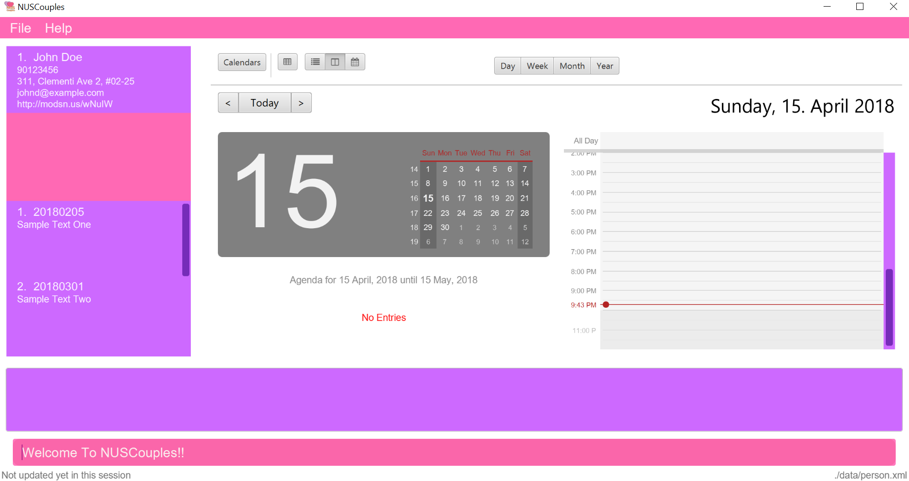

= NUSCouples
ifdef::env-github,env-browser[:relfileprefix: docs/]

https://travis-ci.org/CS2103JAN2018-T09-B4/main[image:https://travis-ci.org/CS2103JAN2018-T09-B4/main.svg?branch=master[Build Status]]
https://ci.appveyor.com/project/marlenekoh/main[image:https://ci.appveyor.com/api/projects/status/qnuriba83lw19gln?svg=true[Build status]]
https://coveralls.io/github/CS2103JAN2018-T09-B4/main?branch=master[image:https://coveralls.io/repos/github/CS2103JAN2018-T09-B4/main/badge.svg?branch=master[Coverage Status]]
https://app.codacy.com/app/marlenekoh/main[image:https://api.codacy.com/project/badge/Grade/83f1bb05107a4a1c9a76bbb8d65ef6bb[Codacy Badge]]
https://gitter.im/se-edu/Lobby[image:https://badges.gitter.im/se-edu/Lobby.svg[Gitter chat]]

ifdef::env-github[]

endif::[]

ifndef::env-github[]
image::images/Ui.png[width="600"]
endif::[]

* This is a desktop application for Couples in National University of Singapore(NUS).
* It has a GUI but most of the user interactions happen using a CLI (Command Line Interface).
* Our Features:
** Compare NUS timetables and find your partner's location based on his/her timetable,
** Plan dates and be notified of special events (e.g. Valentine's day) with our built-in Scheduler,
** Start your personal diary to keep your memories with your significant other ... and more!

== Site Map

* <<UserGuide#, User Guide>>
* <<DeveloperGuide#, Developer Guide>>
* <<AboutUs#, About Us>>
* <<ContactUs#, Contact Us>>

== Acknowledgements

* Some parts of this sample application were inspired by the excellent http://code.makery.ch/library/javafx-8-tutorial/[Java FX tutorial] by
_Marco Jakob_.
* Libraries used: https://github.com/TomasMikula/EasyBind[EasyBind], https://github.com/TestFX/TestFX[TextFX], https://bitbucket.org/controlsfx/controlsfx/[ControlsFX], https://github.com/FasterXML/jackson[Jackson], https://github.com/google/guava[Guava], https://github.com/junit-team/junit4[JUnit4]
* Original source code at https://github.com/se-edu/addressbook-level4[AddressBook-Level4 project] created by SE-EDU initiative

== Licence : link:LICENSE[MIT]
